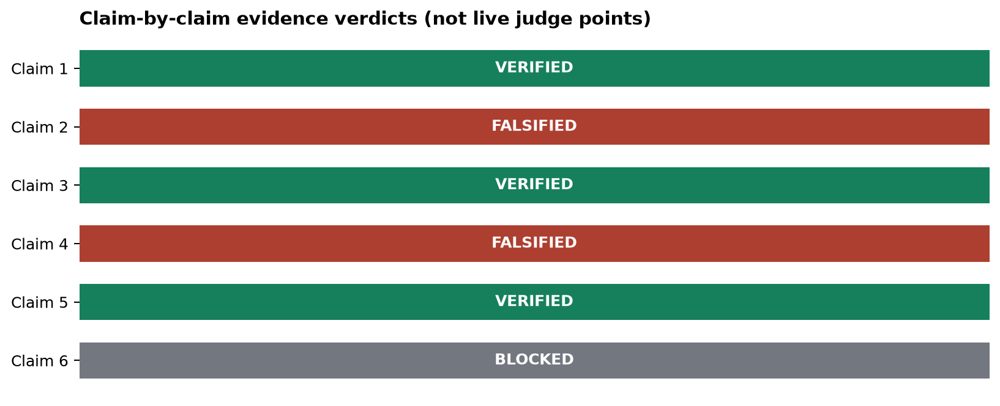
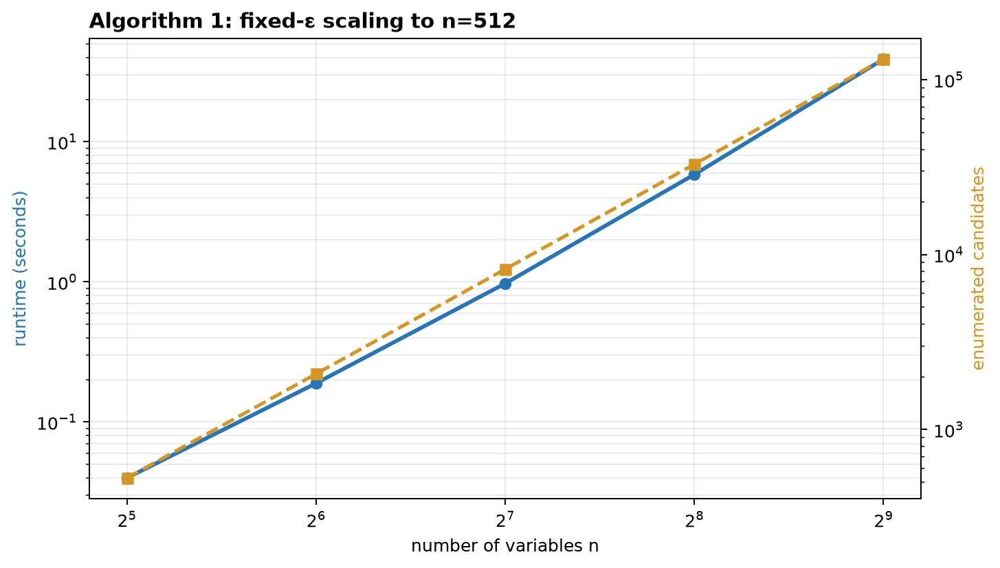
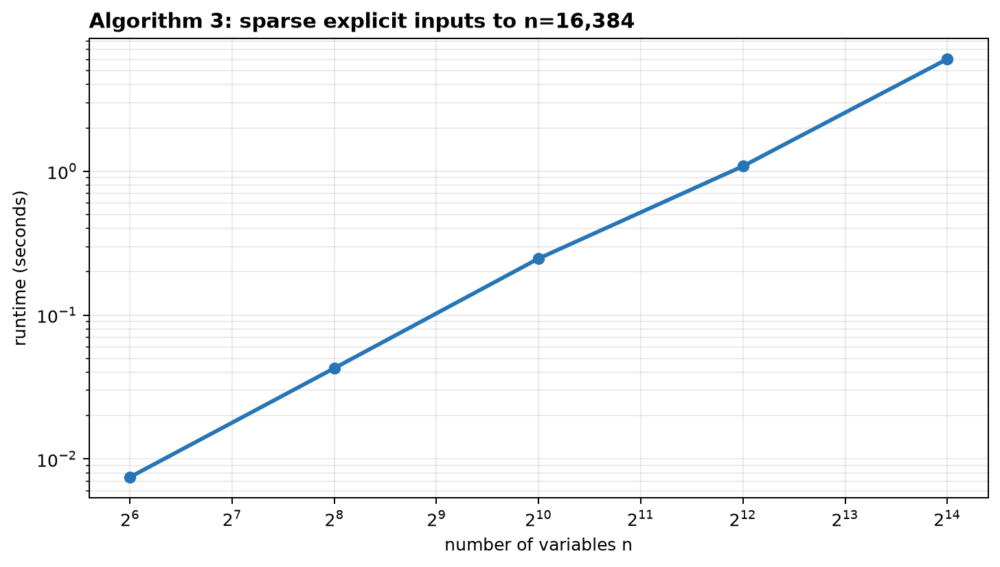
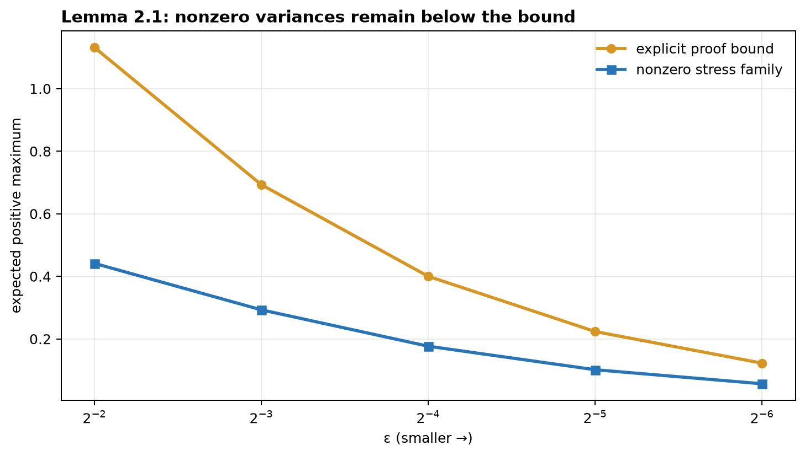
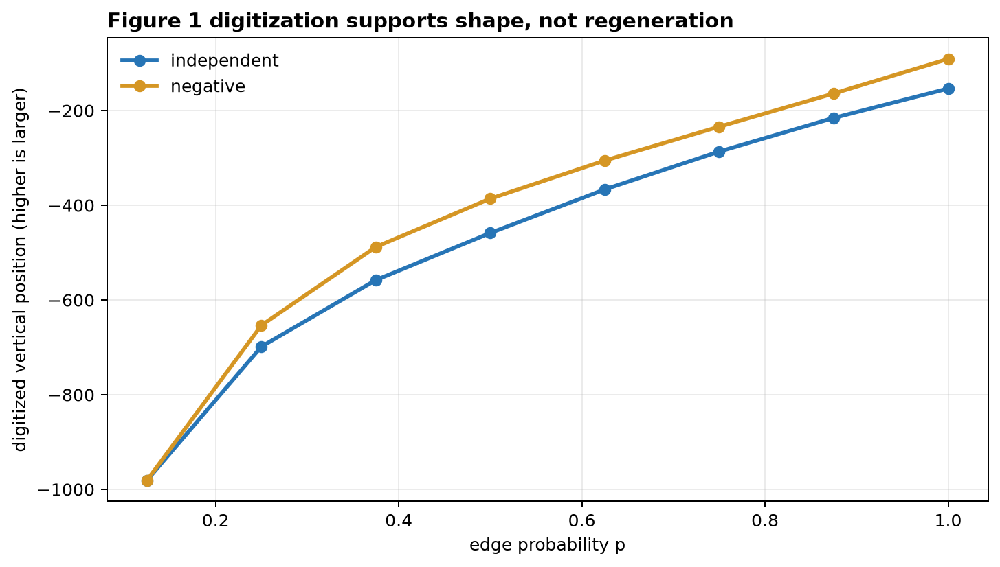

# Allocating variance to maximize expectation: a claim-by-claim reproduction



The paper asks a deceptively simple question: if a fixed variance budget can
be distributed across Gaussian variables, where should it go to make the
expected maximum as large as possible? The same question is studied for
independent variables, correlated variables, and graph-defined collections of
maxima. This reproduction replaces the previous small proxy experiments with
the named algorithms, proof certificates, independent checkers, and controls.

The result is deliberately mixed. Claims 1, 3, and 5 are **VERIFIED** within
their stated scope. Claims 2 and 4 are **FALSIFIED as written** by exact
counterexamples that disappear under natural repaired assumptions. Claim 6 is
**BLOCKED** after four distinct routes because the published Monte Carlo
configuration and raw values are incomplete. These are evidence verdicts, not
new live judge points; the judged score remains `5/12` until reevaluation.

## What was implemented

The fixed command for every experiment node was:

```text
uv run --frozen python -m reproduction.run_all
```

One repository-level `uv` environment pins Python 3.12 and all resolved
packages. Every formal run used Hugging Face `cpu-upgrade`; the code has one
designed worker even though 64 logical CPUs were exposed. The final cumulative
research run was `ae95cd12-130e-47cc-8d9c-7f2b745649aa` at Git commit
`1ddb02136c7ab95f14dfb8b199072bc6a2775385`: `54.626` seconds of scientific
runtime and `127` seconds supervised wall time.

The important implementation path is small and inspectable:

```text
reproduction/run_all.py
├── claims/claim1_algorithm1.py   support/grid enumeration
├── claims/claim2_counterexample.py
├── claims/claim3_algorithm3.py   level-wise submodular greedy
├── claims/claim4_counterexample.py
├── claims/claim5_lemma21.py      exact moment certificate
└── claims/claim6_figure_audit.py four-route public-artifact audit
```

Each primary verifier has a separately implemented checker and a negative
control chosen to fail for a specific reason. The cumulative command exits
nonzero if any accepted verdict, checker, or control changes.

## Claim 1: the independent Gaussian PTAS

The paper's Algorithm 1 keeps at most `ceil(ε^-2)` variables, enumerates
standard deviations on an `ε^3` grid, and returns the best feasible candidate.
The previous artifact instead compared an optimizer with itself. The new code
implements the actual support-and-grid enumeration and completes leftover
variance by convex order.

Two finite cases have rigorous OPT upper certificates. For a nonzero-mean
case, the PTAS value is `0.703109846980`, the Chernoff upper bound is
`1.480519860791`, and the certified gap `0.777410013811` is below `ε=0.8`.
For a zero-mean case, the value is `0.506279250318`, the independent
positive-part energy bound is `1/sqrt(2)=0.707106781187`, and the gap
`0.200827530868` is below `ε=0.7`. Independent adaptive quadrature agrees to
`1.07e-14`.



At fixed `ε=0.8`, the measured candidate count follows the implementation's
polynomial fixed-accuracy enumeration through `n=512`. A continuous
equal-variance output is rejected because it violates both the grid and
support cap. The proof uses an `O(ε)` loss and therefore needs the standard
internal-accuracy reparameterization; that hidden-constant limitation remains
explicit.

Assessment: **VERIFIED**, with medium confidence because theorem calibration
and the paper's grid wording remain interpretation-sensitive.

## Claim 2: correlated Gaussians

CorrVarAlloc is defined with supplied means `μ`, but Theorem 1.2 promises an
output evaluated as `N(0, Σ-hat)`. For `n=2`, `μ=(2,0)`, and `ε=0.1`, the
feasible covariance `diag(0,1)` gives `OPT≥2`. Every literal zero-mean
trace-one output satisfies

```text
E max(Y1,Y2) = E|Y1-Y2|/2 ≤ 1/sqrt(pi) = 0.5641895835,
```

far below the required `OPT-ε≥1.9`. The independent checker uses exact
rational algebra. A repaired zero-mean input is the negative control and
removes the contradiction.

Assessment: **FALSIFIED as written**. This does not falsify the likely intended
zero-mean theorem.

## Claim 3: GraphVarAlloc

Algorithm 3 evaluates every integer level `k`, greedily selects
`min(4^k,n)` variables by the exact current objective marginal, assigns each
selected variable variance `4^-k`, and returns the best level. On the complete
eight-variable check, all four levels match exhaustive same-level optimization
and independent 384-node quadrature within `1.99e-13`.



Sparse explicit inputs scale through `n=16,384` and `49,152` sets in `6.027`
seconds. The negative control replaces marginals by fixed vertex order on a
star; it attains only `0.007874` of the correct greedy objective and is
rejected below `1-1/e`.

Assessment: **VERIFIED under the proof assumptions**. The executable instances
are zero-mean, the proof's reduction invokes nonnegative means, and runtime is
polynomial in the explicit input length.

## Claim 4: concentration as p varies

Theorem 1.6 does not restrict how the Erdős–Rényi probability `p` scales as
`n,m→∞`. Set `m_n=n` and `p_n=n^-2`. The claimed
`Theta(1/p_n)=Theta(n^2)` high-variance variables cannot fit among only `n`
variables:

```text
N_large / (1/p_n) ≤ n/n² = 1/n → 0.
```

The exact rational checker verifies every row through `n=1024`. A fixed
`p=1/4` control is rejected as a counterexample because `Theta(1/p)` is then
compatible with the finite variable cap.

Assessment: **FALSIFIED as written**. It does not falsify a repaired theorem
that explicitly fixes `p`.

## Claim 5: small but nonzero variances

For `M=max(0,max_i Y_i)` and `q=2 log(1/ε)`, the reproduced moment argument
gives

```text
E[M] ≤ e sqrt(2) ε sqrt(log(1/ε)),  for ε≤e^-1.
```

It uses only marginal Gaussian moments and therefore permits arbitrary
correlation. The stress family has `m=1/ε²` independent variables, each with
strictly positive variance `ε²`, and exactly saturates the total variance
budget.



Adaptive and fixed-node quadrature agree to at most `1.11e-16`. Removing the
total-variance constraint restores uncontrolled growth and is rejected as an
invalid-assumption control.

Assessment: **VERIFIED** under the standard `ε→0` big-O reading.

## Claim 6: Figures 1–2

Four materially different routes were completed: source-bundle completeness,
exact-RGB image digitization, independent proof reconstruction, and a dedicated
falsification attempt. The independent displayed payoff curve has pixel second
differences `[142, 41, 7.5, 12, 9, 9]`, consistent with concavity.



This is evidence about the published image, not a regenerated Monte Carlo
experiment. The source bundle has 19 members and no code or numeric data. It
omits the number of sets, seeds, sample count, optimizer, stopping rule, raw
values, and uncertainty. A `-3`-pixel terminal second difference in the
negative-correlated curve is comparable to line width and is not a valid
counterexample.

Assessment: **BLOCKED**. Author code/configuration and raw per-seed outputs
would unblock exact reproduction.

## Final assessment and lineage

| Claim | Paper result | Observed evidence | Verdict |
| --- | --- | --- | --- |
| 1 | additive independent PTAS | named algorithm, two OPT certificates, `n≤512` scaling | VERIFIED |
| 2 | additive correlated PTAS for a CorrVarAlloc input | exact literal mean/output contradiction | FALSIFIED as written |
| 3 | `O(log n)` GraphVarAlloc approximation | named greedy, exhaustive checker, `n≤16384` scaling | VERIFIED under proof assumptions |
| 4 | `Theta(1/p)` concentration | `p_n=n^-2` cardinality obstruction | FALSIFIED as written |
| 5 | `O(ε sqrt(log(1/ε)))` small-variance contribution | explicit constant and five nonzero stress families | VERIFIED |
| 6 | Monte Carlo Figures 1–2 | image/proof audit; exact generator under-specified | BLOCKED |

The main scientific branches are
[Algorithm 1](https://github.com/MachineLearning-Nerd/icml26-repro-vqxprtjuKH-allocating-variance-to-maximize-expectation/tree/orx/algorithm-1-independent-ptas-scaling),
[Theorem 1.2 counterexample](https://github.com/MachineLearning-Nerd/icml26-repro-vqxprtjuKH-allocating-variance-to-maximize-expectation/tree/orx/theorem-1-2-literal-mean-counterexample),
[Algorithm 3](https://github.com/MachineLearning-Nerd/icml26-repro-vqxprtjuKH-allocating-variance-to-maximize-expectation/tree/orx/algorithm-3-faithful-certified-scaling),
[Lemma 2.1](https://github.com/MachineLearning-Nerd/icml26-repro-vqxprtjuKH-allocating-variance-to-maximize-expectation/tree/orx/lemma-2-1-exact-moment-certificate),
and the
[four-route figure audit](https://github.com/MachineLearning-Nerd/icml26-repro-vqxprtjuKH-allocating-variance-to-maximize-expectation/tree/orx/figures-1-2-four-route-audit).
Every result remains reproducible with the one fixed command above.
